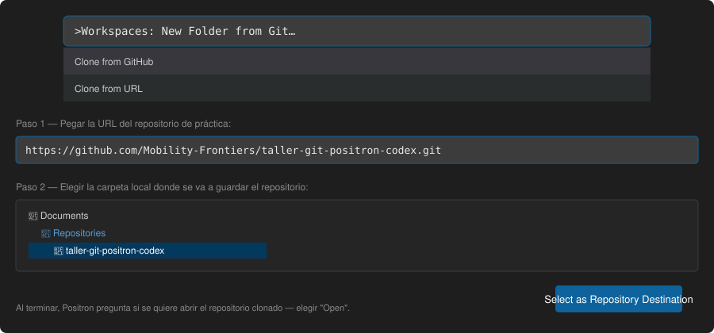
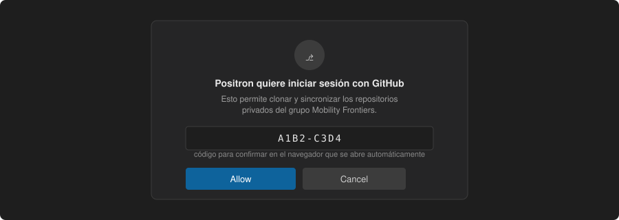
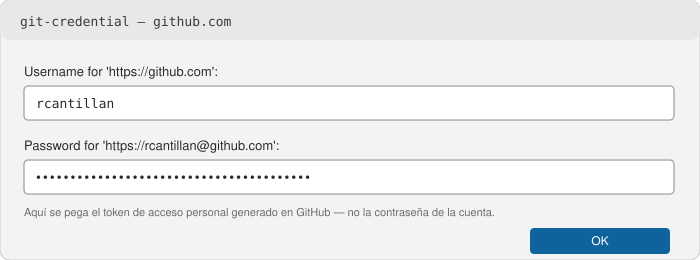
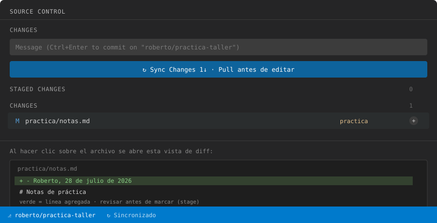
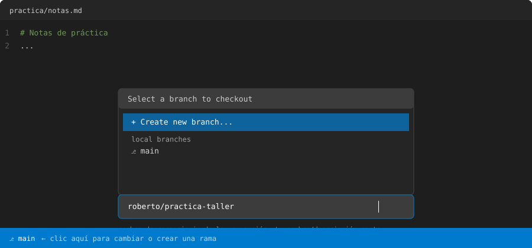
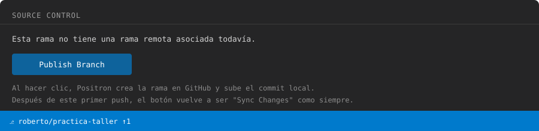
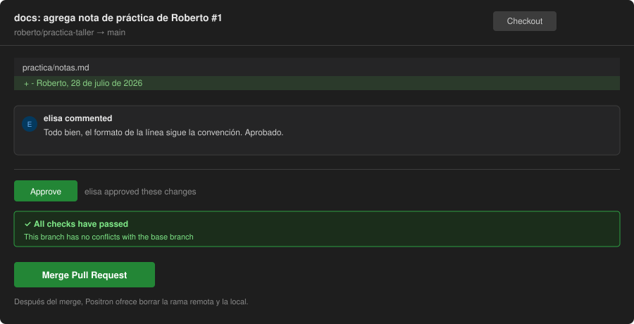

En un grupo de investigación, los problemas de control de versiones rara vez se anticipan: se descubren cuando una persona sobrescribe sin saberlo el trabajo de otra, o cuando un script deja de ejecutarse después de una actualización y no queda claro a qué versión anterior conviene volver. Este documento reúne los conceptos y procedimientos de Git y GitHub necesarios para evitar ese tipo de incidentes, aplicados al flujo de trabajo habitual del grupo: repositorios en R, análisis que se desarrollan de forma incremental, y colaboración simultánea de varias personas sobre un mismo pipeline.

Los ejercicios se hacen sobre `taller-git-positron-codex`, un repositorio creado para esta actividad — no sobre `sfb-mobility-networks` ni ningún otro repo real del grupo.

**Requisitos previos:** Positron instalado; Git configurado con nombre de usuario y correo electrónico (`git config --global user.name` / `user.email`); una cuenta de GitHub con acceso al repositorio de práctica.

## Clonar el repositorio de práctica

Antes de generar el token, cada persona necesita su propia copia local del repositorio. Desde Positron:

1. Paleta de comandos (`Cmd/Ctrl+Shift+P`) → **Git: Clone**.
2. Elegir **Clone from GitHub** (si ya hay sesión iniciada) o **Clone from URL** y pegar la dirección del repositorio.
3. Elegir la carpeta local donde va a quedar guardado.



Si es la primera vez que Positron accede a un repositorio del grupo, va a pedir autorización con la cuenta de GitHub — se abre el navegador, se confirma un código, y desde ahí Positron queda autenticado para esa cuenta:



Al terminar de clonar, Positron pregunta si se quiere abrir la carpeta — elegir **Open**.

::: {.exercise}
**Ejercicio 1 — Clonar el repositorio de práctica**

- [ ] Clonar `taller-git-positron-codex` desde Positron (Git: Clone).
- [ ] Autorizar el acceso con la cuenta de GitHub si se solicita.
- [ ] Abrir la carpeta clonada en Positron.
:::

## Autenticación: el token de acceso personal

Desde hace algunos años, GitHub no acepta la contraseña de la cuenta para operaciones por HTTPS. Si Positron o la terminal solicitan usuario y contraseña al ejecutar `push` y se ingresa la contraseña de la cuenta, la operación fallará. En su lugar, GitHub requiere un **token de acceso personal**, que reemplaza a la contraseña en este tipo de operaciones.

Cada persona genera su propio token, con su propia cuenta de GitHub, antes de la demo — no es algo que se pueda compartir entre personas, y sin él Positron no va a poder hacer `commit` ni `push` durante el taller.

Procedimiento, desde github.com:

1. Ícono de perfil (esquina superior derecha) → **Settings**.
2. Al final del menú lateral izquierdo, **Developer settings**.
3. **Personal access tokens** → **Fine-grained tokens** → **Generate new token**.
4. Asignar un nombre descriptivo (por ejemplo, `positron-taller`) y una fecha de expiración razonable — 90 días es suficiente para no dejarlo indefinido ni tener que repetir el procedimiento con frecuencia.
5. En **Repository access**, seleccionar *Only select repositories* y marcar `taller-git-positron-codex`, además de cualquier otro repositorio del grupo en el que se vaya a trabajar.
6. En **Permissions → Repository permissions**, ubicar **Contents** y asignarle **Read and write** — este es el permiso que habilita `push`.
7. **Generate token**. GitHub lo muestra una única vez: debe copiarse antes de cerrar la página, ya que no puede recuperarse posteriormente.

Con el token disponible, la primera vez que Positron o `git push` soliciten credenciales:

- **Usuario:** el nombre de usuario de GitHub.
- **Contraseña:** el token, pegado tal cual, aunque el campo indique "password".



Tras el primer uso, el sistema operativo almacena la credencial (Keychain en macOS, Credential Manager en Windows, o el *credential helper* configurado en Linux), y no vuelve a solicitarse hasta que el token expire.

> El token equivale a una contraseña con permisos acotados: no debe compartirse por canales de mensajería ni incluirse en ningún archivo del repositorio. Si se expone por error, debe revocarse de inmediato desde la misma página de *Personal access tokens* y generarse uno nuevo.

::: {.exercise}
**Ejercicio 2 — Generar el token**

- [ ] Generar el token siguiendo los siete pasos anteriores.
- [ ] Copiarlo a un lugar temporal y seguro (no a un archivo del repositorio ni a un canal de mensajería).
- [ ] Tenerlo a mano para el ejercicio siguiente, donde Positron lo va a solicitar como contraseña.
:::

## El modelo de tres estados

Un archivo pasa por tres estados antes de quedar registrado en la historia del proyecto:

```
edición              marcado                      registro
(working dir)   →    (staging, git add)   →      (commit)
```

`git add` no envía nada a GitHub — únicamente indica qué cambios se incluirán en el próximo commit. El commit en sí es una fotografía local del proyecto; nada de esto llega al repositorio remoto hasta que se ejecuta un `push`. En sentido inverso, `pull` incorpora los cambios que otras personas ya subieron:

```
GitHub (origin)   --pull-->   copia local
copia local       --push-->   GitHub (origin)
```

De este esquema se desprende la práctica más importante del taller: ejecutar `pull` antes de comenzar a trabajar. No se trata de una formalidad, sino de una necesidad — si otra persona subió cambios entre el último `pull` y el próximo `push`, Git exigirá resolver esa diferencia. Es preferible hacerlo al inicio de la sesión de trabajo que al final, bajo presión de tiempo.

## Procedimiento: pull, edición, commit, push

Con `taller-git-positron-codex` abierto en Positron, el panel de control de código fuente (ícono de rama en la barra lateral izquierda) concentra la mayor parte de las acciones.

**Desde Positron (recomendado):**

**Paso 1.** Sincronizar antes de realizar cualquier modificación, mediante el botón de sincronización o "Pull" del panel. Si el repositorio ya está actualizado, se continúa; si trae cambios nuevos, se confirma que el mecanismo de sincronización funciona correctamente.

**Paso 2.** Abrir `practica/notas.md` y añadir una línea con nombre y fecha. Al guardar, el archivo aparece en el panel de control de código fuente como modificado.

**Paso 3.** Revisar el diff antes de continuar — la vista comparativa muestra en rojo el contenido eliminado y en verde el contenido añadido. Esta revisión permite detectar modificaciones no intencionadas antes de registrarlas.

**Paso 4.** Marcar el archivo (equivalente a `git add`) y confirmar el commit con un mensaje descriptivo — por ejemplo, `docs: agrega nota de práctica de Roberto`, no `cambios` o `fix`. El commit queda registrado únicamente en la copia local.

**Paso 5.** Ejecutar `push`. El commit queda entonces disponible en GitHub para el resto del grupo.

El panel completo, con los cinco pasos anteriores en el mismo lugar, se ve así:



**Alternativa: terminal integrada de Positron.** El mismo procedimiento, escrito directamente en la terminal (`Terminal → New Terminal` en Positron):

```bash
git pull
git add practica/notas.md
git commit -m "docs: agrega nota de práctica de Roberto"
git push
```

Ambos métodos producen el mismo resultado; la terminal queda ahí para quien ya la use por costumbre.

::: {.exercise}
**Ejercicio 3 — Pull, editar, commit, push**

- [ ] Sincronizar el repositorio (Pull) antes de editar cualquier archivo.
- [ ] Abrir `practica/notas.md` y agregar una línea con nombre y fecha.
- [ ] Revisar el diff en el panel de Source Control antes de continuar.
- [ ] Marcar el archivo (stage) y confirmar el commit con un mensaje descriptivo.
- [ ] Ejecutar push y verificar en GitHub.com que el commit aparece en el historial.
:::

## Conflictos: dos personas, un mismo archivo

Ejecutar `pull` antes de trabajar evita la mayoría de los conflictos, aunque no todos. Si dos personas modifican la misma línea de un archivo en un intervalo breve, se produce un conflicto — un resultado esperado del funcionamiento de Git, no un error.

Para observarlo en la práctica: en parejas, ambas personas parten del mismo commit en `practica/ejemplo_analisis.R` y modifican la misma línea de la función `diversidad_dominios()` sin ejecutar `pull` entre ambas ediciones. La primera persona en hacer `push` no encuentra problemas; la segunda recibe un rechazo, y al ejecutar `pull`, Git marca el archivo de la siguiente manera:

```r
diversidad_dominios <- function(df) {
  df %>%
<<<<<<< HEAD
    group_by(id, dominio) %>%
    summarise(n = n(), .groups = "drop")
=======
    group_by(id) %>%
    summarise(n_dominios = n_distinct(dominio), .groups = "drop")
>>>>>>> origin/main
}
```

**Desde Positron (recomendado):** el editor presenta este mismo bloque con opciones sobre cada sección en conflicto — *Accept Current*, *Accept Incoming*, *Accept Both* — para seleccionar la versión que corresponde, o combinar ambas manualmente. Así se ve dentro del editor:


Una vez resuelto, se guarda el archivo, se marca (add) y se confirma el commit desde el panel de control de código fuente, tal como en el ejercicio anterior, y finalmente se ejecuta push.

**Alternativa: terminal.** Editar el archivo a mano para eliminar las marcas (`<<<<<<<`, `=======`, `>>>>>>>`) dejando el contenido correcto, y luego:

```bash
git add practica/ejemplo_analisis.R
git commit -m "fix: resuelve conflicto en diversidad_dominios"
git push
```

La frecuencia de estos conflictos se reduce mediante hábitos de trabajo, no mediante herramientas: trabajar en una rama propia en lugar de directamente sobre `main`; notificar al equipo antes de modificar un script utilizado por varias personas; y realizar commits pequeños y frecuentes en lugar de uno extenso al final de la jornada. Una regla sin excepciones: no debe ejecutarse `push --force` sobre una rama utilizada por otras personas, ya que reescribe la historia y puede eliminar commits ajenos sin advertencia.

::: {.exercise}
**Ejercicio 4 — Provocar y resolver un conflicto (en parejas)**

- [ ] Ambas personas hacen `pull` para partir del mismo commit en `practica/ejemplo_analisis.R`.
- [ ] Cada persona modifica la misma línea de la función `diversidad_dominios()`, sin volver a hacer `pull`.
- [ ] La primera persona hace `push` — debería completarse sin problemas.
- [ ] La segunda persona hace `push`, recibe el rechazo, y luego `pull` para traer el conflicto al editor.
- [ ] Resolver el conflicto en Positron (Accept Current / Incoming / Both), guardar, hacer commit y `push`.
:::

## Ramas y pull requests

Una rama es una copia paralela del proyecto que permite experimentar sin afectar `main`; los cambios permanecen aislados hasta que se decide integrarlos.

### Convención del grupo: una rama por persona y por tarea

A partir de este taller, el siguiente procedimiento queda establecido como estándar para los repositorios del grupo, no solo como recomendación:

1. Nadie hace commit directo sobre `main`. Todo cambio, por pequeño que sea, se hace en una rama.
2. El nombre de la rama sigue el formato `nombre/descripción-corta` — por ejemplo, `roberto/limpieza-datos-gps` o `consuelo/modelo-difusion-v2`. El nombre identifica de inmediato quién está trabajando en qué, algo especialmente útil cuando varias personas tienen ramas abiertas al mismo tiempo.
3. Se abre una rama nueva por cada tarea o análisis distinto, no una única rama personal que se reutiliza indefinidamente — evita que una rama acumule cambios de temas no relacionados y facilita la revisión.
4. La integración a `main` se hace exclusivamente mediante pull request, con revisión de al menos otra persona del grupo antes del merge.

**Desde Positron (recomendado):** el nombre de la rama actual aparece en la esquina inferior izquierda de la ventana. Al hacer clic ahí, Positron despliega un listado con la opción "Create new branch..." y las ramas existentes; al escribir el nombre siguiendo la convención (`tu-nombre/descripción-corta`) y confirmar, Positron cambia automáticamente a esa rama nueva:



El ciclo de edición, commit y push se ejecuta después de manera idéntica al descrito en el ejercicio anterior; la única diferencia es que los cambios quedan aislados en esa rama.

**Alternativa: terminal.**

```bash
git checkout -b tu-nombre/practica-taller
```

### Mínimo del grupo: proteger `main` en GitHub

La convención anterior depende de que cada persona la respete por su cuenta. GitHub permite además declararla a nivel de repositorio, para que quede visible y no dependa solo de la memoria de cada quien. Esta configuración se hace una sola vez por repositorio, idealmente por quien lo administra:

1. En el repositorio, ir a **Settings → Branches**.
2. En **Branch protection rules**, **Add branch protection rule** (o **Add rule**).
3. En **Branch name pattern**, escribir `main`.
4. Marcar como mínimo **Require a pull request before merging** — esto es lo que le pide a GitHub que exija que todo cambio a `main` llegue por PR (con la salvedad que se explica abajo).
5. Opcionalmente, **Require conversation resolution before merging**, para que ningún comentario de revisión quede sin responder antes del merge.
6. Guardar (**Create** / **Save changes**).

::: {.callout-important}
En un repositorio privado dentro de una organización de GitHub en el plan gratuito, esta regla queda configurada pero GitHub advierte que no se aplica técnicamente hasta actualizar la organización a **GitHub Team o Enterprise** — la página de configuración lo indica explícitamente. Mientras eso no ocurra, la regla funciona como una política declarada y visible para todo el grupo, pero el cumplimiento real sigue dependiendo de la convención acordada en esta sección, no de un bloqueo técnico.
:::

Esa integración se solicita mediante un *pull request*: una propuesta formal de incorporar los cambios de una rama a `main`, sujeta a revisión previa. La primera vez que se hace push de una rama nueva, Positron muestra este aviso:



Con la rama publicada, se abre un PR desde la página del repositorio en GitHub — la comparación de ramas queda lista para revisar, con título, descripción y el botón para crearlo:


Allí se visualiza el diff completo, se pueden agregar comentarios línea por línea, y solo tras la aprobación correspondiente se ejecuta el merge:



Una vez integrada, la rama puede eliminarse sin pérdida de información, ya que su historia permanece en `main`.

En un repositorio de investigación compartido, el pull request cumple una función concreta: otra persona revisa el cambio antes de que se mezcle con el análisis principal, y eso es lo que atrapa errores que de otro modo pasarían inadvertidos — una columna mal nombrada, un filtro aplicado de más — antes de que terminen en un resultado.

::: {.exercise}
**Ejercicio 5 — Crear tu rama siguiendo la convención del grupo**

- [ ] Crear una rama con el formato `tu-nombre/practica-taller`, desde Positron (clic en el nombre de la rama, esquina inferior izquierda) o con `git checkout -b tu-nombre/practica-taller`.
- [ ] Editar `practica/notas.md` y hacer un commit en esa rama.
- [ ] Publicar la rama (push) — Positron ofrece el botón "Publish Branch" la primera vez.
- [ ] En GitHub.com, abrir un pull request desde esa rama hacia `main`.
- [ ] Revisar el diff del PR y, con otra persona del grupo, aprobarlo y hacer merge.
- [ ] Confirmar que, de aquí en adelante, cada tarea nueva en los repos del grupo comienza con este mismo procedimiento: rama con nombre `tu-nombre/descripción-corta`, nunca commits directos sobre `main`.
:::

## Codex en Positron: generación y corrección de código

Positron incorpora un panel dedicado a **Codex**, el agente de código de OpenAI, disponible como pestaña propia en el panel lateral derecho (junto a Session, Connections, History y Claude Code). A diferencia de pedirle algo a un asistente genérico, Codex opera directamente sobre los archivos del proyecto abierto: puede explicar una función existente, generar una nueva, corregir un error a partir del mensaje de la consola, y proponer los cambios como un diff editable antes de aplicarlos.

### Qué modelo usar según la tarea

Codex no tiene un único modelo detrás — y la elección afecta tanto la calidad del resultado como el tiempo de respuesta y la cuota de uso disponible:

- **Para explorar y entender código, o pedir explicaciones simples:** conviene un modelo liviano (por ejemplo, `gpt-5.4-mini`). Responde más rápido y consume menos cuota; es suficiente para tareas que no requieren razonamiento extenso, como leer una función y resumir qué hace.
- **Para generar código nuevo, refactorizar, o corregir un error no trivial:** conviene el modelo especializado en programación (por ejemplo, `gpt-5.3-codex` o la versión más reciente disponible). Tiene mejor desempeño en tareas agénticas de código — seguir instrucciones de varios pasos, mantener consistencia con el resto del script — a costa de mayor tiempo de respuesta.

**Regla práctica para un uso eficiente:** empezar con el modelo liviano para explorar y entender el código, y escalar al modelo especializado solo cuando la tarea es efectivamente generar o corregir algo con cierta complejidad. Usar el modelo más potente para preguntas simples es un gasto de cuota innecesario; usar el liviano para generar código nuevo suele dar resultados menos confiables. El modelo se cambia desde el selector del panel, en cualquier momento de la sesión.

Sobre `practica/ejemplo_analisis.R`, dos solicitudes de prueba, cada una con el modelo que le corresponde:

> **Con el modelo liviano:** Explica qué hace `diversidad_dominios()` y qué ocurriría si `dominio` contuviera valores `NA`.

> **Con el modelo especializado en código:** Escribe una función que reciba un data.frame con columnas `id`, `dominio` y `fecha`, y devuelva el conteo de dominios distintos por `id` y por mes.

El código generado por Codex sigue el mismo procedimiento que cualquier otra modificación: se revisa el diff antes de aplicarlo, se ejecuta para confirmar que cumple lo esperado, y si se integra a un repositorio compartido, se somete a revisión mediante pull request, siguiendo la convención de ramas establecida en la sección anterior. Codex acelera la escritura del código; no sustituye la comprensión de su funcionamiento ni la revisión de lo que produce.

::: {.exercise}
**Ejercicio 6 — Usar Codex con el modelo adecuado para cada tarea**

- [ ] Abrir la pestaña Codex en el panel lateral, con `practica/ejemplo_analisis.R` activo.
- [ ] Seleccionar el modelo liviano y pedir la explicación de `diversidad_dominios()` y el caso de valores `NA` en `dominio`.
- [ ] Cambiar al modelo especializado en código y pedir la función que agrupa por `id` y por mes.
- [ ] Revisar el diff de lo generado, ejecutarlo, y recién entonces hacer commit siguiendo la convención de ramas del taller.
:::

## Resolución de problemas frecuentes

La siguiente tabla reúne los mensajes de error más habituales en este tipo de flujo de trabajo.

| Mensaje | Causa | Solución |
|---|---|---|
| `fatal: not a git repository` | La carpeta actual no corresponde al repositorio, o este no se clonó correctamente | Verificar la existencia de una carpeta `.git`; en caso contrario, clonar nuevamente |
| `Please tell me who you are` | Git no ha sido configurado en esta máquina | Ejecutar `git config --global user.name` y `user.email` |
| `could not read Username for 'https://github.com'` | No hay credenciales almacenadas para el repositorio remoto | Reintentar el push e ingresar usuario y token cuando se solicite (ver sección de autenticación) |
| `rejected — non-fast-forward` | Existen commits en GitHub que la copia local no posee | Ejecutar `pull` (o sincronizar en Positron) antes de reintentar el `push` |
| `Permission denied (publickey)` | GitHub no reconoce la llave SSH configurada, o esta no existe | Utilizar HTTPS en lugar de SSH para el remoto, o revisar la configuración en GitHub → Settings → SSH Keys |
| Marcas `<<<<<<<` en un archivo | Dos personas modificaron la misma línea | Resolver manualmente en Positron (ver sección de conflictos), guardar, commit, push |

`taller-git-positron-codex` queda ahí después de hoy — sigue siendo el lugar para volver a probar cualquiera de estos escenarios cuando haga falta.
